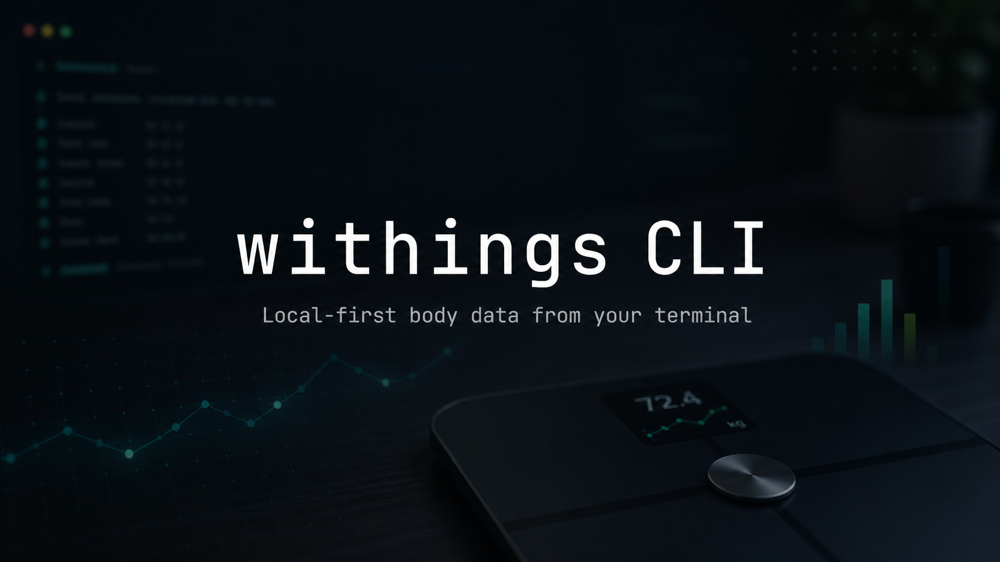

<p align="center">
  
</p>

<h1 align="center">withings-cli</h1>

<p align="center">
  Withings Public API のための薄いローカルファースト CLI です。
</p>

<p align="center">
  <a href="https://www.npmjs.com/package/withings-cli">
    
  </a>
  <a href="https://github.com/Hiro5409/withings-cli/actions/workflows/ci.yml">
    
  </a>
  <a href="./LICENSE">
    
  </a>
</p>

<p align="center">
  <a href="README.md">English</a> | 日本語
</p>

## Quick Start

[Bun](https://bun.sh/) が必要です。

1. Withings の開発者アプリケーションを
   <https://developer.withings.com/dashboard/> で作成します。コールバック
   URL には以下を指定してください:

   ```text
   http://localhost:8765/auth/withings/callback
   ```

2. そのアプリケーションの OAuth クレデンシャルを環境変数に設定します:

   ```bash
   export WITHINGS_CLIENT_ID="your-client-id"
   export WITHINGS_CLIENT_SECRET="your-client-secret"
   ```

3. ログインします（ブラウザで Withings の認可ページが開きます）:

   ```bash
   bunx withings-cli login
   ```

4. 最新の体組成を取得します:

   ```bash
   bunx withings-cli latest
   ```

## Install

`bunx withings-cli` ならインストール不要で使えます。繰り返し使う場合は
CLI を global install します:

```bash
bun add -g withings-cli
withings --help
```

ローカル開発の場合:

```bash
bun install
bun run dev -- status
bun run build
./withings --help
```

## Library Use

root export から小さな library surface も利用できます:

```ts
import { createWithingsClient, type TokenSet, type TokenStore } from "withings-cli";

// この最小 KV store は、たとえば 1 つの Durable Object instance 内など、
// 呼び出しがすでに直列化されている場合に安全です。
function kvTokenStore(kv: KVNamespace, key = "withings:tokens"): TokenStore {
  return {
    async load(): Promise<TokenSet | undefined> {
      const value = await kv.get<TokenSet>(key, "json");
      return value ?? undefined;
    },
    async save(tokenSet: TokenSet): Promise<void> {
      await kv.put(key, JSON.stringify(tokenSet));
    },
  };
}

const client = createWithingsClient({ store: kvTokenStore(env.WITHINGS_KV) });
const latest = await client.fetchLatestMeasure();
```

Withings の refresh token はローテーションされます。同じ token を複数リクエストが
同時に refresh しうる場合は、`TokenStore` 実装側の `withRefreshLock` で
load -> refresh -> save 全体を Durable Object、D1 transaction、その他の lock により
直列化してください。

## Usage

```bash
withings <command> [options]
```

開発中は `withings` を `bun src/main.ts` に読み替えてください。

### Global options

| Flag           | Description                                                    |
| -------------- | -------------------------------------------------------------- |
| `-f, --format` | 出力フォーマット: `json` または `table`（デフォルト: `table`） |
| `--profile`    | OAuth プロファイル名（デフォルト: `default`）                  |
| `--no-color`   | カラー出力を無効化                                             |

### Auth

```bash
withings login                  # ブラウザ経由の OAuth ログイン
withings status                 # ログイン状態を表示
withings status --format json
withings logout                 # ローカルのクレデンシャルを削除
```

トークンは `~/.config/withings-cli/credentials.json` に `0600`
パーミッションで保存されます。OAuth クレデンシャルや生のコールバック URL を
コミットしないでください。`logout` はローカルのクレデンシャルを削除する
だけです。Withings のアクセストークンは数時間で自然に失効します。login
フローの仕組みは [OAuth の設計メモ](#oauth-の設計メモ)を参照してください。

`status --format json` はクレデンシャルが存在しない場合でも構造化された
JSON を返します:

```json
{
  "authenticated": false,
  "profile": "default",
  "configDir": "~/.config/withings-cli",
  "credentialsPath": "~/.config/withings-cli/credentials.json"
}
```

### Body measures

```bash
withings latest                 # 計測タイプごとの最新値
withings latest --format json
withings measures --limit 30    # 計測履歴
withings measures --startdate 1710000000 --enddate 1720000000 --format json
withings measures --lastupdate 1720000000 --format json
```

正規化された計測フィールドは現在以下をカバーしています:

| Withings type | Field             |
| ------------- | ----------------- |
| `1`           | `weightKg`        |
| `5`           | `fatFreeMassKg`   |
| `6`           | `fatRatioPercent` |
| `8`           | `fatMassKg`       |
| `76`          | `muscleMassKg`    |
| `77`          | `hydrationKg`     |
| `88`          | `boneMassKg`      |

この CLI は `measure-getmeas` の `more` / `offset` ページネーションを
追従します。

### Activity

```bash
withings activity               # 日次のアクティビティサマリー
withings activity --limit 7 --format json
withings activity --startdateymd 2026-06-01 --enddateymd 2026-06-10
withings activity --lastupdate 1720000000
```

`activity` は 1 日 1 行で、`date`, `steps`, `distanceM`,
`caloriesKcal`, `totalCaloriesKcal`, `softMin`, `moderateMin`, `intenseMin`,
`hrAverage` を正規化して返します。elevation や heart-rate zone など、
正規化していないフィールドは `data_fields` 付きの
`raw measurev2 getactivity` で確認します。activity の webhook category は
`16` です。

### Sleep

```bash
withings sleep                  # 昼寝を含む睡眠期間ごとに 1 行
withings sleep --limit 7 --format json
withings sleep --startdateymd 2026-06-01 --enddateymd 2026-06-10
withings sleep --lastupdate 1720000000
```

`sleep` は昼寝を含む睡眠期間ごとに 1 行で、`date`, `startdate`, `enddate`,
`sleepScore`, `totalSleepTimeMin`, `deepMin`, `lightMin`, `remMin`,
`awakeMin`, `hrAverage` を正規化して返します。minute-level の `sleepv2.get`
は専用コマンド化せず、必要な場合は `raw sleepv2 get` で扱います。sleep の
webhook category は `44` です。

### Webhooks

Withings は新しいデータが届いたときにあなたのサーバーへ通知を POST できます
（[notification overview](https://developer.withings.com/developer-guide/v3/data-api/notifications/notification-overview/)）。
CLI はこの購読の管理を担当します。コールバックの受信は、外部から到達可能な
あなた自身のエンドポイントで行ってください。

```bash
withings notify list
withings notify subscribe --callbackurl https://example.com/hook --appli 1
withings notify revoke --callbackurl https://example.com/hook
```

よく使う `--appli` の通知カテゴリ:

| appli | データ         |
| ----- | -------------- |
| `1`   | 体重 / 体組成  |
| `4`   | 心拍 / 血圧    |
| `16`  | アクティビティ |
| `44`  | 睡眠           |

### Raw API

```bash
withings raw user getdevice --format json
withings raw measure getmeas '{"category":1,"meastypes":"1,6,76,77,88"}'
echo '{"startdateymd":"2026-06-01","enddateymd":"2026-06-10","data_fields":"steps,distance,elevation,hr_zone_0,hr_zone_1,hr_zone_2,hr_zone_3"}' | withings raw measurev2 getactivity
```

raw コマンドは、まだ専用コマンドにしていない Withings endpoint の逃げ道です。
OAuth クレデンシャルをリフレッシュし、form-urlencoded POST を送り、
`action=<action>` を自動で追加し、`{ status, body }` のエンベロープを
無加工で出力します。任意の JSON object は form field として送信されます。
JSON 引数を省略した場合は stdin JSON も受け付けます。旧
`raw measure-getmeas` は互換 alias として残しています。

### Error JSON

`--format json` を指定した場合、CLI エラーは構造化 JSON として stderr に
出力されます。Withings API の status エラーには、agent やスクリプトが分岐
できるフィールドが含まれます:

```json
{
  "error": "Withings API returned status 503 for user.get.",
  "exitCode": 4,
  "code": "invalid_params",
  "withingsStatus": 503,
  "endpoint": "user.get",
  "why": "The HTTP request succeeded, but Withings rejected the API operation.",
  "hint": "user.get is restricted to account-creation integrations such as Withings Cellular Solutions or Mobile SDK. For this OAuth app, use user.getdevice or user.getgoals."
}
```

## Development

```bash
bun install
bun run typecheck
bun test
```

### OAuth の設計メモ

login フローは Withings の認可 URL をブラウザで開き、短命の認可コードを
ローカルのコールバックサーバー経由でトークンに交換します。
[Withings の OAuth 実装](https://developer.withings.com/developer-guide/v3/integration-guide/public-health-data-api/get-access/oauth-web-flow)が許す範囲で
[RFC 8252 (OAuth 2.0 for Native Apps)](https://datatracker.ietf.org/doc/html/rfc8252)
に従っています:

- ループバックリダイレクトを使った Authorization Code フロー。コールバック
  サーバーは `127.0.0.1` にバインドし、現在のログイン試行用に生成した
  CSRF トークンと `state` が一致しないリクエストは無視します。
- **PKCE なし**: Withings は PKCE をサポートしていません。`state` 検証と
  ループバック限定のリスナーがその代わりを担います。
- **`client_secret` をトークンと並べて保存**: Withings の
  [トークンエンドポイント](https://developer.withings.com/api-reference/#tag/oauth2)
  はリフレッシュのたびに `client_id` と `client_secret` を要求するため、
  登録した secret を `credentials.json`（mode `0600`）に保持し、環境変数を
  再エクスポートせずにリフレッシュできるようにしています。
- Withings は他の点でも標準の OAuth 2.0 から逸脱しています: トークン
  エンドポイントは `action=requesttoken` パラメータを必要とし、レスポンスを
  `{ status, body }` のエンベロープで包みます。手書きの auth モジュールが
  これらの癖を吸収します。

### 型のポリシー

Withings のワイヤー型はすべて手書きで、それを fetch するモジュールに
コロケーションしています（例: `measure.getmeas` の型は
`src/api/measures.ts` 内）。レスポンスは API 境界でランタイムチェックにより
パースし、`as` アサーションは使いません。想定外のペイロードは型システムに
嘘をつく代わりに `undefined` のフィールドに退化します。

Withings の OpenAPI ドキュメントからのコード生成は意図的に行っていません。
あれは API リファレンスページのレンダリング用に書かれたもので、codegen には
向きません（action 多重化された RPC エンドポイントを空白パディング URL で
重複回避している、必須パラメータの値が散文にしか書かれていない、など）。
ドキュメントは型を手書きする際の参照資料として `spec/openapi.json` に
同梱しています（出典: [Withings developer documentation](https://developer.withings.com/api-reference/)）。
